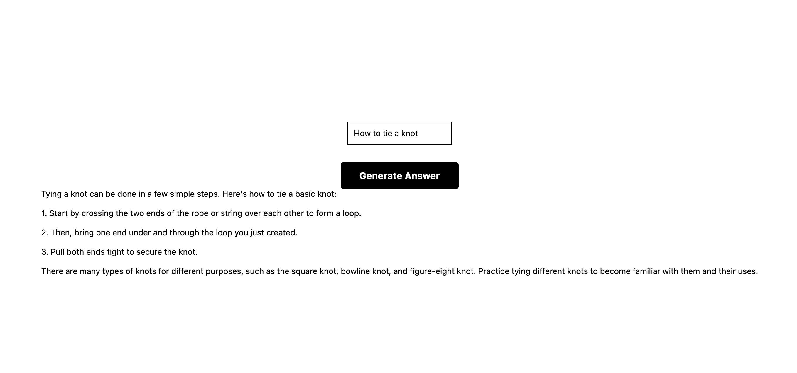

# AI Question Answering app utilizing OpenAI API

## How to get started

_Note:_ This project needs the following downloads to run successfully

```
$ node --version
v21.1.0
$ npm --version
10.4.0
$ nvm --version
0.39.7
$ npx --version
10.2.4
```

1. Checkout this project, get your own OpenAI key, and replace it in the app.js file for the dummy key
## Replace it in this line
```
apiKey: 'Put Your API Key Here'
```
2. Get this project to your current working directory and run the following command
``` 
npm run web
```
3. This commmand should open the project in a new web tab and then you should be able to generate images, if not in browser click this url

[http://localhost:8081/](http://localhost:8081/)

4. Now, type in a prompt to generate an answer using OpenAI
## Sample Answer below 

Sample 1


